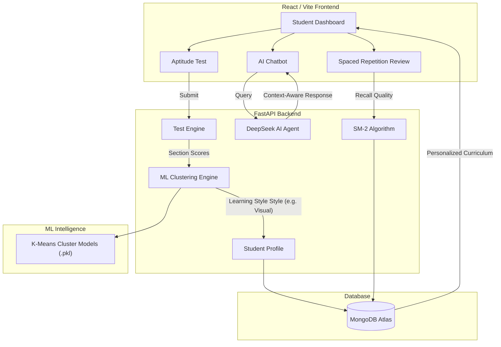

# Access2Education — AI-Powered Personalized Learning Platform

Access2Education is a cutting-edge, full-stack educational platform designed to revolutionize the way students learn. By leveraging **Machine Learning (ML)** for learning-style clustering, the **SM-2 Spaced Repetition Algorithm** for long-term memory retention, and **AI Tutoring**, it adapts it's curriculum to every student's unique "Learning DNA."

---

## 🚀 System Architecture & Workflow

The following diagram illustrates the seamless interaction between the Frontend, Backend, ML Engine, and Database.



---

## ✨ Key Features

### 🧠 Adaptive Learning DNA (ML Clustering)
The platform doesn't just teach—it learns about you. Upon entry, students take a multi-dimensional aptitude test. Our **K-Means Clustering model** analyzes results across Logical, Verbal, Numerical, Memory, and Attention scores to categorize the student into one of four distinct learning styles:
- **Visual Learner**: Prioritizes diagrams and video lectures.
- **Conceptual Thinker**: Focuses on deep theory and case studies.
- **Practice-Based**: emphasizes hands-on coding and projects.
- **Step-by-Step**: Follows structured, sequential notes.

### 📅 Smart Revision (SM-2 Spaced Repetition)
We use the **SuperMemo-2 (SM-2)** algorithm to optimize your memory. The system tracks your performance on every topic and calculates the exact date you need to revise it to prevent the "forgetting curve."

### 🤖 AI Tutor (DeepSeek Integration)
Integrated with the **DeepSeek-V3** model, our AI chatbot acts as a 24/7 personal tutor, answering complex questions, explaining code, and providing hints based on the student's current progress.

---

## 🛠️ Technology Stack

- **Frontend**: React (Vite), Tailwind CSS, Framer Motion, Lucide Icons.
- **Backend**: FastAPI (Python), Motor (Async MongoDB), Pydantic.
- **Machine Learning**: Scikit-learn, Numpy, Joblib (Ensemble Clustering).
- **Database**: MongoDB Atlas.
- **Deployment**: Vercel (Monorepo setup).

---

## 🌐 Deployment (Vercel)

This project is configured as a Vercel-ready monorepo.

### Prerequisites
1. A **MongoDB Atlas** account for the cloud database.
2. A **DeepSeek API Key** for the AI Chatbot.

### Quick Deploy
1. Link this repository to **Vercel**.
2. Vercel will auto-detect the `vercel.json` and `Frontend/package.json`.
3. Add the following **Environment Variables** in the Vercel Dashboard:
   - `MONGODB_URL`: Your Atlas connection string.
   - `SECRET_KEY`: A secure random string for JWT.
   - `DEEPSEEK_API_KEY`: Your DeepSeek key.
   - `DEBUG`: `False`.

---

## 📁 Project Structure

```text
Access2Education/
├── Backend/            # FastAPI Server, Routes, and DB logic
├── Frontend/           # React/Vite Application
├── ML/                 # Training scripts and Pickled Models (.pkl)
├── data/               # Metadata and datasets
├── Dockerfile.backend  # Self-hosting Docker config
└── vercel.json         # Vercel Monorepo Router
```

---

## 👨‍💻 Author
**Sambit** — [GitHub](https://github.com/sambitji)

*"Accessing Quality Education for Everyone"*
